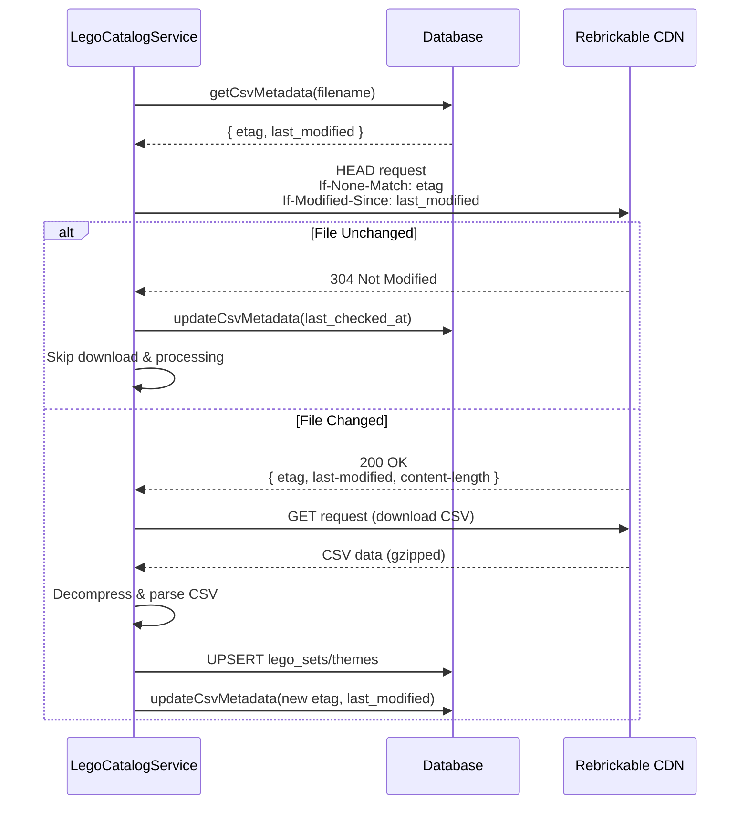

# LEGO Sets Catalog System

## Overview

The LEGO Sets Catalog System maintains a comprehensive database of all official LEGO sets ever produced, sourced from Rebrickable CSV downloads. The system includes intelligent change detection to efficiently skip processing when files haven't changed, reducing bandwidth usage and processing time.

## Architecture

### Data Source: Rebrickable

**Source**: Rebrickable CDN (BunnyCDN) at `https://cdn.rebrickable.com/media/downloads/`

**CSV Files**:
- `sets.csv.gz` - All LEGO sets with metadata (set number, name, year, theme, pieces, etc.)
- `themes.csv.gz` - Theme hierarchy information

**Update Frequency**: Daily (files are updated daily by Rebrickable)

**Change Detection**: The CDN supports HTTP conditional requests (ETag and Last-Modified headers), allowing efficient change detection without downloading unchanged files.

### Database Schema

The catalog data is stored in a separate `catalog` schema to keep it isolated from pipeline data:

#### `catalog.lego_sets`
Main catalog table containing all official LEGO sets:
- `set_num` (TEXT, unique) - Official LEGO set number (e.g., "75192-1")
- `name` (TEXT) - Set name
- `year` (INTEGER) - Release year
- `theme_id` (INTEGER) - Reference to theme
- `num_parts` (INTEGER) - Official piece count
- `set_img_url` (TEXT) - Official set image URL (constructed from `set_num` if not provided in CSV: `https://cdn.rebrickable.com/media/sets/{set_num}.jpg`)
- `set_url` (TEXT) - Official LEGO.com URL
- `last_modified` (TIMESTAMP) - When Rebrickable last updated this set

#### `catalog.themes`
Theme hierarchy table:
- `id` (INTEGER, primary key) - Rebrickable theme ID
- `name` (TEXT) - Theme name
- `parent_id` (INTEGER, nullable) - Parent theme reference (self-referential)

#### `catalog.csv_file_metadata`
Tracks CSV file state for change detection:
- `filename` (TEXT, primary key) - e.g., 'sets.csv.gz', 'themes.csv.gz'
- `etag` (TEXT) - HTTP ETag from last successful download
- `last_modified` (TIMESTAMP) - Last-Modified header value from server
- `content_length` (BIGINT) - File size in bytes
- `last_checked_at` (TIMESTAMP) - When we last checked for changes
- `last_downloaded_at` (TIMESTAMP) - When we last successfully downloaded

### Change Detection Flow

The system uses HTTP conditional requests to detect changes before downloading:



### Refresh Process

1. **Check for Changes**: For each CSV file (sets.csv.gz, themes.csv.gz):
   - Retrieve last known metadata (ETag, Last-Modified) from database
   - Make HEAD request with conditional headers
   - If 304 Not Modified: skip file, update `last_checked_at`
   - If 200 OK: proceed to download

2. **Download & Parse**: For changed files:
   - Download CSV file (gzipped)
   - Decompress using Node.js zlib
   - Parse CSV using `csv-parse` library
   - Transform data to match database schema
   - Construct `set_img_url` from `set_num` if not provided in CSV: `https://cdn.rebrickable.com/media/sets/{set_num}.jpg`

3. **Upsert to Database**: 
   - Batch upsert sets/themes (1000 records per batch)
   - Use PostgreSQL `ON CONFLICT` for upsert logic
   - Track statistics (new vs updated records)

4. **Update Metadata**: 
   - Store new ETag and Last-Modified after successful processing
   - Update `last_downloaded_at` timestamp

### Job Tracking

Catalog refresh operations are tracked using the unified job system in `pipeline.jobs`:

- **Job Type**: `lego_catalog_refresh`
- **Timeout**: 60 minutes
- **Statistics Tracked** (stored in `metadata` JSONB field):
  - `files_checked` - Total CSV files checked
  - `files_changed` - Files that had updates
  - `files_unchanged` - Files skipped (304 responses)
  - `sets_found`, `sets_new`, `sets_updated`
  - `themes_found`, `themes_new`, `themes_updated`

All job tracking uses the unified `pipeline.jobs` table - no separate catalog-specific job table is needed.

### API Endpoints

#### `POST /api/catalog/refresh`
Triggers a manual catalog refresh job. The job is created synchronously and returned in the response.

**Response**:
```json
{
  "status": "queued",
  "message": "Catalog refresh job queued",
  "job": {
    "id": "uuid",
    "status": "running",
    "started_at": "2025-01-20T...",
    "completed_at": null,
    "error_message": null,
    "metadata": {}
  }
}
```

The job executes asynchronously via Inngest. The returned job object can be used immediately in the UI without additional API calls.

### Backend UI

**Path**: `/backend/resources/catalog`

Features:
- View catalog statistics (total sets, themes, last refresh)
- Display change detection metrics (files checked/changed/unchanged)
- View recent refresh jobs with detailed statistics
- Manual refresh trigger button (can trigger multiple jobs)
- Real-time job status updates via polling (every 2 seconds when jobs are running)
- Immediate job display after triggering (no page reload needed)

### Benefits of Change Detection

- **Bandwidth Savings**: Skip downloads when files haven't changed (validated: 304 responses work)
- **Database Efficiency**: Avoid unnecessary upserts when no changes
- **Faster Execution**: 304 responses are near-instantaneous
- **Cost Reduction**: Less processing time on serverless platforms
- **Server-Friendly**: Reduces load on Rebrickable CDN

### Error Handling

- **Network Errors**: Retry with exponential backoff (3 attempts)
- **CSV Parsing Errors**: Log and continue (skip invalid rows)
- **Database Errors**: Rollback transaction, mark job as failed
- **304 Responses**: Not an error - expected behavior when files unchanged

### Future Enhancements

- Reconciliation service to match job listings to catalog sets
- Set search/filter API endpoints
- Set detail pages showing official vs. listing data
- Price tracking per set over time
- More precise new/updated counting (using created_at vs updated_at timestamps)

## Implementation Details

### Service: `LegoCatalogService`

Located in `lib/catalog/lego-catalog-service.ts`

**Key Methods**:
- `refreshCatalog(jobId: string)` - Main refresh method with change detection
- `checkFileChanged(filename: string)` - Check if CSV file changed using conditional requests
- `downloadCsvFile(filename: string)` - Download and decompress CSV
- `parseAndUpsertSets(csvContent, jobId, progressTracker)` - Parse and upsert sets
- `parseAndUpsertThemes(csvContent, jobId, progressTracker)` - Parse and upsert themes
- `getCsvMetadata(filename)` - Get stored metadata
- `updateCsvMetadata(filename, metadata)` - Update stored metadata

### Dependencies

- `csv-parse` - CSV parsing library
- `zlib` (Node.js built-in) - Gzip decompression
- Native `fetch` - HTTP requests with conditional headers

### Database Migrations

- `20250119000002_add_lego_catalog_schema.sql` - Creates catalog schema and tables
- `20250119000003_add_catalog_refresh_job_type.sql` - Adds job type to enum
- `20250120000001_backfill_set_img_url.sql` - Backfills image URLs for existing sets

### Configuration

The `catalog` schema must be exposed in PostgREST API:

**Local Development** (`supabase/config.toml`):
```toml
schemas = ["public", "graphql_public", "pipeline", "catalog"]
extra_search_path = ["public", "extensions", "pipeline", "catalog"]
```

**Production**: Configure in Supabase Dashboard → Project Settings → API → Exposed schemas

## Usage

### Manual Refresh

1. Via Backend UI: Navigate to `/backend/resources/catalog` and click "Refresh Catalog"
2. Via API: `POST /api/catalog/refresh`

### Monitoring

- View job status: `GET /api/jobs?type=lego_catalog_refresh`
- View catalog stats: `/backend/resources/catalog`
- Check job details: Job metadata contains all refresh statistics

### Troubleshooting

**Schema not accessible error**:
- Ensure `catalog` schema is in PostgREST exposed schemas
- Restart local Supabase: `npx supabase stop && npx supabase start`

**304 errors during download**:
- This was a bug that's been fixed - downloads no longer use conditional headers

**Migration conflicts**:
- Ensure migration timestamps are unique
- Current migrations: `20250119000002` and `20250119000003`
