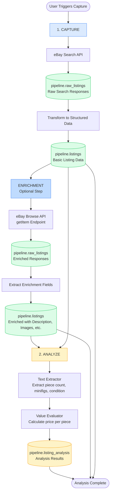
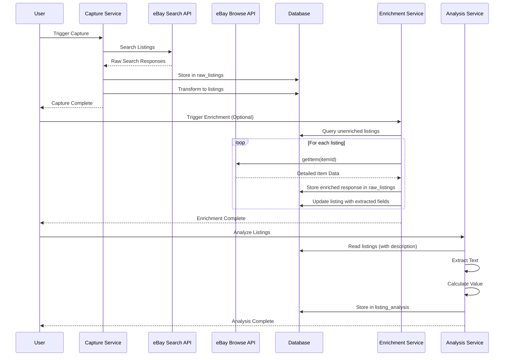
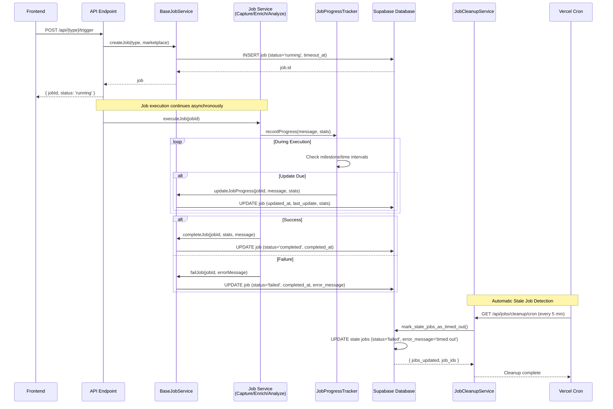
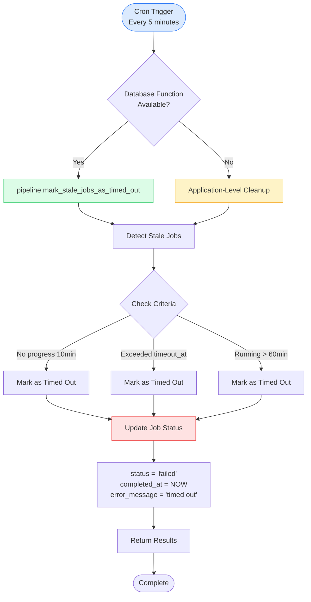

# Data Pipeline Documentation

This document describes how data flows through the LEGO marketplace scraper system.

## Pipeline Overview

The system processes data through two main stages: **Capture** (with optional enrichment) and **Analyze**.



## Stage 1: Capture

**Purpose**: Collect LEGO listings from marketplace APIs

### Initial Capture

**Process**:
1. Marketplace adapter (eBay) searches for listings using keywords via Search API
2. Raw API responses are stored in `pipeline.raw_listings` (ground truth)
3. Raw responses are transformed into structured `pipeline.listings` records
4. Deduplication ensures no duplicate listings are stored
5. Existing listings are updated with new `last_seen_at` timestamp

**Data Flow**:
```
eBay Search API → raw_listings → Transform → listings (basic data)
```

### Enrichment (Optional)

**Purpose**: Enhance listings with detailed information from eBay Browse API

**Process**:
1. Enrichment service queries for unenriched listings (`enriched_at IS NULL`)
2. For each listing, calls eBay Browse API `getItem` endpoint
3. Raw enriched responses stored in `pipeline.raw_listings`
4. Extracted fields updated in `pipeline.listings`:
   - `description` - Full listing description
   - `additional_images` - Array of additional image URLs
   - `condition_description` - Detailed condition information
   - `category_path` - Full category hierarchy
   - `item_location` - Structured location data
   - `estimated_availabilities` - Stock/quantity information
   - `buying_options` - Array of buying options
5. Listing marked as enriched with `enriched_at` timestamp

**Rate Limiting**: Configurable delay between API calls (default: 200ms) to prevent API abuse

**Data Flow**:
```
listings (unenriched) → eBay Browse API getItem → raw_listings (enriched) → Extract Fields → listings (enriched)
```

**Key Tables**:
- `pipeline.raw_listings`: Raw JSON responses from APIs (both search and enrichment)
- `pipeline.listings`: Structured listing data with enrichment fields
- `pipeline.jobs`: Job tracking for async operations (capture, enrichment, etc.)

**Job Tracking**:
- All capture, enrichment, and analysis operations are tracked in `pipeline.jobs` table
- Job types: `ebay_refresh_listings` (initial capture), `ebay_enrich_listings` (enrichment), `analyze_listings` (batch analysis)
- Jobs include metadata, status (running/completed/failed), progress tracking, and outcome statistics

**API Endpoints**:
- `POST /api/capture/trigger` - Trigger initial capture (creates job with type `ebay_refresh_listings`)
- `POST /api/capture/enrich` - Trigger enrichment process (creates job with type `ebay_enrich_listings`)
- `POST /api/analyze/trigger` - Trigger batch analysis (creates job with type `analyze_listings`)
- `GET /api/jobs` - View all jobs with optional filtering
- `POST /api/jobs/cleanup` - Manually trigger stale job cleanup
- `GET /api/jobs/cleanup` - Get stale job statistics

## Stage 2: Analyze

**Purpose**: Extract key attributes from listings and evaluate value

**Process**:
1. Analysis service queries for unanalyzed listings (no `listing_analysis` record)
2. For each listing, text extractor parses title and description
3. Extracts: piece count, minifig count, condition
4. Value evaluator calculates price per piece
5. Results stored in `pipeline.listing_analysis`
6. Job progress is tracked throughout batch processing

**Extraction Methods**:
- **Piece Count**: Regex patterns for "500 pieces", "~1000 pcs", etc.
- **Minifig Count**: Regex patterns for "5 minifigs", "10 figs", etc.
- **Condition**: Keyword matching for "new", "used", "sealed", etc.
- **Price Per Piece**: Calculated from listing price ÷ piece count

**Key Tables**:
- `pipeline.listing_analysis`: Extracted attributes and calculated values
- `pipeline.jobs`: Job tracking for batch analysis operations (type: `analyze_listings`)

**Data Flow**:
```
listings (unanalyzed) → Batch Analysis Job → Text Extraction → Value Evaluation → listing_analysis
```

**API Endpoints**:
- `POST /api/analyze/trigger` - Trigger batch analysis (creates job with type `analyze_listings`)
  - Optional parameters: `listingIds` (array) or `limit` (number)


## Schema Organization

### `pipeline` Schema
All data related to the capture and analysis pipeline:
- `raw_listings`: Raw API responses (ground truth) - includes both search and enrichment responses
- `listings`: Structured listing data with enrichment fields (description, additional_images, condition_description, category_path, item_location, estimated_availabilities, buying_options)
- `listing_analysis`: Extracted attributes and calculated values
- `jobs`: Job tracking for async operations with type enum (e.g., `ebay_refresh_listings`, `ebay_enrich_listings`, `analyze_listings`)
  - Includes progress tracking (`updated_at`, `last_update`), timeout management (`timeout_at`), and statistics

### `public` Schema
All data related to user-facing features:
- `profiles`: User profiles (linked to auth.users)

## Data Flow Sequence



## Job Processing System

All asynchronous operations in the pipeline are managed through a unified job processing system. This ensures consistent tracking, progress monitoring, and error handling across all job types.

### Archetypal Job Flow



### Job Lifecycle

1. **Job Creation**: When an API endpoint is triggered, `BaseJobService.createJob()` is called:
   - Creates a job record with `status='running'`
   - Sets `timeout_at` based on job type (see Timeout Configuration below)
   - Sets initial `started_at`, `updated_at`, and `last_update` fields
   - Returns the job ID immediately to the frontend

2. **Job Execution**: The service executes asynchronously:
   - Uses `JobProgressTracker` to periodically update progress
   - Updates `updated_at` and `last_update` fields at regular intervals
   - Updates statistics (e.g., `listings_found`, `listings_new`, `listings_updated`)

3. **Job Completion**: When execution finishes:
   - **Success**: `BaseJobService.completeJob()` sets `status='completed'` and `completed_at`
   - **Failure**: `BaseJobService.failJob()` sets `status='failed'`, `completed_at`, and `error_message`

4. **Progress Tracking**: `JobProgressTracker` combines two update strategies:
   - **Milestone-based**: Updates every N items processed (e.g., every 10 listings)
   - **Time-based**: Updates every N milliseconds (e.g., every 5 seconds)
   - Updates are triggered when either condition is met

### Job Types

#### 1. Capture Jobs (`ebay_refresh_listings`)
- **Purpose**: Initial capture of listings from marketplace APIs
- **Timeout**: 30 minutes
- **Progress Updates**: During search, transformation, and deduplication phases
- **Statistics**: `listings_found`, `listings_new`, `listings_updated`

#### 2. Enrichment Jobs (`ebay_enrich_listings`)
- **Purpose**: Enrich existing listings with detailed information
- **Timeout**: 60 minutes
- **Progress Updates**: During listing processing loop (every 10 items or 5 seconds)
- **Statistics**: `listings_found`, `listings_updated`

#### 3. Analysis Jobs (`analyze_listings`)
- **Purpose**: Batch analysis of listings to extract attributes and calculate values
- **Timeout**: 15 minutes
- **Progress Updates**: During individual listing analysis (milestone and time-based)
- **Statistics**: Custom stats based on analysis results

### Job Timeout and Cleanup

The system implements a hybrid approach for detecting and handling stale jobs:

#### Timeout Configuration

Each job type has a configurable timeout set when the job is created:

| Job Type | Timeout Duration |
|----------|----------------|
| `ebay_refresh_listings` | 30 minutes |
| `ebay_enrich_listings` | 60 minutes |
| `analyze_listings` | 15 minutes |
| Default (unknown types) | 30 minutes |

The `timeout_at` field is automatically set based on the job type when `BaseJobService.createJob()` is called.

#### Stale Job Detection

Jobs are considered stale and marked as timed out if **any** of the following conditions are met:

1. **No Progress Update**: `updated_at < NOW() - 10 minutes`
   - Indicates the job hasn't reported progress in 10 minutes
   - Suggests the job may be stuck or crashed

2. **Exceeded Timeout**: `timeout_at IS NOT NULL AND timeout_at < NOW()`
   - The job has exceeded its type-specific timeout duration
   - Prevents jobs from running indefinitely

3. **Absolute Maximum**: `started_at < NOW() - 60 minutes`
   - Safety net: no job should run longer than 60 minutes
   - Prevents edge cases where timeout_at might not be set

#### Cleanup Mechanisms

**1. Database Function (Primary Method)**
- Function: `pipeline.mark_stale_jobs_as_timed_out()`
- Efficiently detects and marks stale jobs in a single database operation
- Updates jobs with:
  - `status = 'failed'`
  - `completed_at = NOW()`
  - `last_update = 'Job timed out: No progress detected or exceeded maximum runtime'`
  - `error_message = 'Job timed out after X minutes'`

**2. Application-Level Cleanup (Fallback)**
- Method: `JobCleanupService.cleanupStaleJobsApplicationLevel()`
- Used when database function is unavailable or fails
- Queries for stale jobs and updates them individually
- Provides more complex cleanup logic if needed

**3. Scheduled Execution**
- **Vercel Cron**: Runs every 5 minutes via `GET /api/jobs/cleanup/cron`
- **Manual Trigger**: `POST /api/jobs/cleanup` for on-demand cleanup
- **Monitoring**: `GET /api/jobs/cleanup` returns statistics about running and stale jobs

#### Cleanup Flow



### Job Monitoring

The frontend UI (`/backend/resources/jobs`) provides real-time job monitoring:

- **Auto-refresh**: Polls `/api/jobs` every 2 seconds when running jobs are detected
- **Progress Display**: Shows `updated_at`, `last_update`, and job statistics
- **Status Indicators**: Visual indicators for running, completed, failed, and timed out jobs
- **Manual Refresh**: Explicit refresh button for immediate updates

### Job Database Schema

The `pipeline.jobs` table includes:

- **Core Fields**: `id`, `type`, `marketplace`, `status`, `metadata`
- **Timestamps**: `started_at`, `completed_at`, `updated_at`, `timeout_at`
- **Progress**: `last_update` (text field with contextual progress message)
- **Statistics**: `listings_found`, `listings_new`, `listings_updated`
- **Error Handling**: `error_message`

Indexes are created on:
- `updated_at` (for efficient stale job queries)
- `timeout_at` (for timeout-based detection)
- `type` and `started_at` (for filtering and sorting)

## Key Design Decisions

1. **Raw Listings as Ground Truth**: All raw API responses are preserved in `raw_listings` for auditability and reprocessing
2. **Two-Step Capture Process**: Initial capture uses Search API for discovery, enrichment uses Browse API for detailed data
3. **Optional Enrichment**: Enrichment is a separate, optional step that can be run independently
4. **Schema Separation**: Pipeline data is isolated from user data for better organization and security
5. **Modular Value Evaluation**: Value evaluators are pluggable, allowing different evaluation strategies
6. **Deduplication**: Prevents duplicate listings while tracking when listings are seen again
7. **Analysis Versioning**: Analysis records include version numbers for algorithm changes
8. **Rate Limiting**: Enrichment includes configurable delays to prevent API abuse
9. **Unified Job Processing**: All async operations use the same job tracking system for consistency
10. **Progress Tracking**: Jobs report progress at regular intervals for visibility and stale detection
11. **Automatic Timeout Detection**: Hybrid approach (database function + application-level) ensures stale jobs are detected and marked
12. **Type-Specific Timeouts**: Different job types have appropriate timeout durations based on expected execution time

