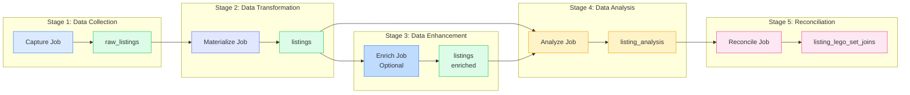
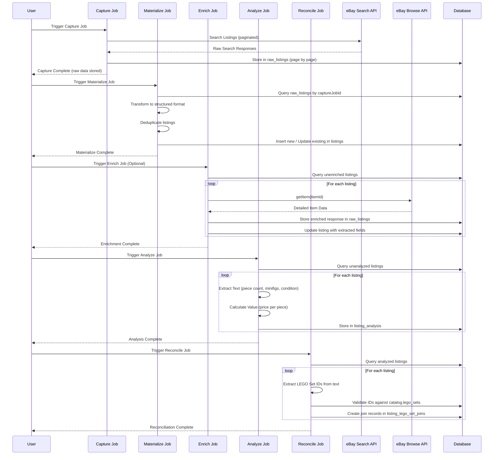
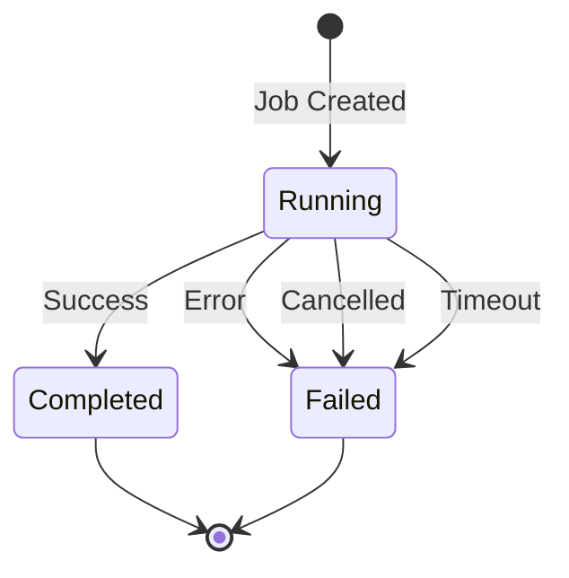

# Data Pipeline Documentation

This document describes how data flows through the LEGO marketplace scraper system, including all five pipeline jobs: **Capture**, **Materialize**, **Enrich**, **Analyze**, and **Reconcile**.

## Pipeline Overview

The system processes data through five sequential stages that transform raw marketplace API responses into analyzed, structured listing data with LEGO set associations.



## Data Flow Sequence



## Job 1: Capture

**Purpose**: Fetch raw listing data from marketplace APIs and store it in the database.

**Process**:
1. Receives search keywords and eBay search parameters
2. Paginates through eBay Search API results (one page per Inngest step)
3. Stores each page of raw API responses immediately to `pipeline.raw_listings`
4. Associates all raw listings with the capture job ID
5. Automatically triggers the Materialize job upon completion

**Key Features**:
- **Page-level steps**: Each page fetch is a separate Inngest step, preventing timeout issues and enabling cancellation
- **Stream processing**: Data is stored immediately, avoiding "output too large" errors
- **Automatic materialization**: Triggers materialize job after capture completes

**Data Flow**:
```
eBay Search API → raw_listings (with job_id) → [Auto-trigger Materialize]
```

**Job Type**: `ebay_refresh_listings`

**Timeout**: 30 minutes

**API Endpoint**: `POST /api/capture/trigger`

### Capture Job Parameters

| Parameter | Type | Required | Default | Description |
|-----------|------|----------|---------|-------------|
| `marketplace` | `string` | No | `'ebay'` | Marketplace identifier. Currently only `'ebay'` is supported. |
| `keywords` | `string[]` | **Yes** | - | Array of search keywords. Multiple keywords are joined with spaces. Must be a non-empty array. |
| `ebayParams` | `EbaySearchParams` | No | See below | eBay-specific search parameters. |

### eBay Search Parameters (`ebayParams`)

| Parameter | Type | Required | Default | Description |
|-----------|------|----------|---------|-------------|
| `entriesPerPage` | `number` | No | `200` | Number of results per page (1-200). |
| `listingTypes` | `string[]` | No | `undefined` | Array of listing types. Options: `'FixedPrice'`, `'AuctionWithBIN'`. |
| `hideDuplicateItems` | `boolean` | No | `undefined` | Whether to hide duplicate items in search results. |
| `categoryId` | `string` | No | `undefined` | eBay category ID to filter results (e.g., `'220'` for LEGO). |
| `marketplaceId` | `string` | No | `process.env.EBAY_MARKETPLACE_ID` or `'EBAY_US'` | eBay marketplace identifier (e.g., `'EBAY_US'`, `'EBAY_GB'`). |
| `enablePagination` | `boolean` | No | `true` | Whether to enable pagination through results. |
| `maxResults` | `number` | No | `10000` | Maximum number of results to fetch (max: 10000). |
| `fieldgroups` | `string` | No | `'EXTENDED'` | Field groups to include in response. Use `'EXTENDED'` for maximum data. |

### Example Request

```json
{
  "marketplace": "ebay",
  "keywords": ["lego bulk", "lego job lot"],
  "ebayParams": {
    "entriesPerPage": 200,
    "listingTypes": ["FixedPrice", "AuctionWithBIN"],
    "hideDuplicateItems": true,
    "categoryId": "220",
    "marketplaceId": "EBAY_US",
    "enablePagination": true,
    "maxResults": 10000,
    "fieldgroups": "EXTENDED"
  }
}
```

**Note**: The `keywords` parameter is required and must be a non-empty array. If not provided, the API will return a 400 error.

## Job 2: Materialize

**Purpose**: Transform raw listings from `raw_listings` table into structured `listings` table, including deduplication.

**Process**:
1. Queries `raw_listings` table for all entries associated with a specific capture job ID
2. Transforms raw API responses into structured listing format using marketplace adapter
3. Deduplicates listings based on `(marketplace, external_id)` unique constraint
4. Inserts new listings into `pipeline.listings`
5. Updates existing listings with new `last_seen_at` timestamp

**Key Features**:
- **Batch processing**: Processes listings in batches of 50 per Inngest step
- **Deduplication**: Prevents duplicate listings while tracking when listings are seen again
- **Job association**: Links materialized listings to the materialize job ID

**Data Flow**:
```
raw_listings (by captureJobId) → Transform → Deduplicate → listings (new/updated)
```

**Job Type**: `ebay_materialize_listings`

**Timeout**: 30 minutes

**API Endpoint**: `POST /api/materialize/trigger`

### Materialize Job Parameters

| Parameter | Type | Required | Default | Description |
|-----------|------|----------|---------|-------------|
| `captureJobId` | `string` | Yes | - | UUID of the capture job whose raw listings should be materialized. |
| `marketplace` | `string` | Yes | - | Marketplace identifier (e.g., `'ebay'`). Must match the marketplace used in the capture job. |

### Example Request

```json
{
  "captureJobId": "123e4567-e89b-12d3-a456-426614174000",
  "marketplace": "ebay"
}
```

**Note**: The Materialize job is automatically triggered by the Capture job upon completion. However, it can also be triggered manually if needed.

## Job 3: Enrich

**Purpose**: Enhance existing listings with detailed information from the eBay Browse API.

**Process**:
1. Queries `pipeline.listings` for unenriched listings (`enriched_at IS NULL`)
2. For each listing, calls eBay Browse API `getItem` endpoint
3. Stores raw enriched responses in `pipeline.raw_listings`
4. Extracts enrichment fields and updates `pipeline.listings`:
   - `description` - Full listing description
   - `additional_images` - Array of additional image URLs
   - `condition_description` - Detailed condition information
   - `category_path` - Full category hierarchy
   - `item_location` - Structured location data
   - `estimated_availabilities` - Stock/quantity information
   - `buying_options` - Array of buying options
5. Marks listing as enriched with `enriched_at` timestamp

**Key Features**:
- **Rate limiting**: Configurable delay between API calls to prevent API abuse
- **Batch processing**: Processes listings in batches of 50 per Inngest step
- **Selective processing**: Only processes listings that haven't been enriched yet

**Data Flow**:
```
listings (unenriched) → eBay Browse API getItem → raw_listings (enriched) → Extract Fields → listings (enriched)
```

**Job Type**: `ebay_enrich_listings`

**Timeout**: 60 minutes

**API Endpoint**: `POST /api/capture/enrich`

### Enrich Job Parameters

| Parameter | Type | Required | Default | Description |
|-----------|------|----------|---------|-------------|
| `marketplace` | `string` | No | `'ebay'` | Marketplace identifier. Currently only `'ebay'` is supported. |
| `limit` | `number` | No | `undefined` | Maximum number of listings to enrich. If not provided, processes all unenriched listings. |
| `delayMs` | `number` | No | `200` | Delay in milliseconds between API calls to prevent rate limiting. |

### Example Request

```json
{
  "marketplace": "ebay",
  "limit": 1000,
  "delayMs": 200
}
```

## Job 4: Analyze

**Purpose**: Extract key attributes from listings and evaluate value.

**Process**:
1. Queries for unanalyzed listings (no `listing_analysis` record exists)
2. For each listing, combines title and description text
3. Text extractor parses text to extract:
   - Piece count (with estimated flag)
   - Minifig count (with estimated flag)
   - Condition
4. Value evaluator calculates price per piece (if price and piece count available)
5. Stores results in `pipeline.listing_analysis`
6. Updates existing analysis records if they already exist

**Key Features**:
- **Batch processing**: Processes listings in batches of 100 per Inngest step
- **Selective processing**: Can analyze specific listings by ID or all unanalyzed listings
- **Analysis versioning**: Analysis records include version numbers for algorithm changes

**Extraction Methods**:
- **Piece Count**: Regex patterns for "500 pieces", "~1000 pcs", etc.
- **Minifig Count**: Regex patterns for "5 minifigs", "10 figs", etc.
- **Condition**: Keyword matching for "new", "used", "sealed", etc.
- **Price Per Piece**: Calculated from listing price ÷ piece count

**Data Flow**:
```
listings (unanalyzed) → Text Extraction → Value Evaluation → listing_analysis
```

**Job Type**: `analyze_listings`

**Timeout**: 15 minutes

**API Endpoint**: `POST /api/analyze/trigger`

### Analyze Job Parameters

| Parameter | Type | Required | Default | Description |
|-----------|------|----------|---------|-------------|
| `listingIds` | `string[]` | No | `undefined` | Array of specific listing IDs to analyze. If provided, only these listings will be analyzed. |
| `limit` | `number` | No | `undefined` | Maximum number of unanalyzed listings to process. If not provided, processes all unanalyzed listings. |

**Note**: If `listingIds` is provided, `limit` is ignored. If neither is provided, all unanalyzed listings are processed.

### Example Requests

**Analyze all unanalyzed listings:**
```json
{}
```

**Analyze specific listings:**
```json
{
  "listingIds": [
    "123e4567-e89b-12d3-a456-426614174000",
    "223e4567-e89b-12d3-a456-426614174001"
  ]
}
```

**Analyze up to 500 unanalyzed listings:**
```json
{
  "limit": 500
}
```

### Job 6: Reconcile

**Purpose**: Extract LEGO set IDs from listing titles and descriptions, validate them against the catalog, and create join records linking listings to LEGO sets.

**Process**:
1. Queries for listings that have been analyzed (have `listing_analysis` records)
2. For each listing, combines title and description text
3. Text extractor uses regex pattern to extract potential LEGO set IDs (e.g., "75192-1", "10294")
4. Validates extracted IDs against `catalog.lego_sets` table
5. Creates join records in `pipeline.listing_lego_set_joins` for validated set IDs
6. Sets `nature` field to "mentioned" for all initial joins

**Key Features**:
- **Batch processing**: Processes listings in batches of 100 per Inngest step
- **Selective processing**: Can reconcile specific listings by ID or all analyzed listings
- **Validation**: Only creates joins for set IDs that exist in the catalog
- **Deduplication**: Unique constraint prevents duplicate join records

**Extraction Methods**:
- **LEGO Set IDs**: Regex pattern `\b\d{3,7}(-\d{1,2})?\b` matches:
  - Main set number: 3-7 digits (e.g., "75192", "10294")
  - Optional version suffix: dash + 1-2 digits (e.g., "-1" in "75192-1")
  - Word boundaries prevent matching partial numbers

**Data Flow**:
```
listings (with analysis) → Text Extraction → ID Validation → listing_lego_set_joins
```

**Job Type**: `reconcile`

**Timeout**: 15 minutes

**API Endpoint**: `POST /api/reconcile/trigger`

### Reconcile Job Parameters

| Parameter | Type | Required | Default | Description |
|-----------|------|----------|---------|-------------|
| `listingIds` | `string[]` | No | `undefined` | Array of specific listing IDs to reconcile. If provided, only these listings will be reconciled. |
| `limit` | `number` | No | `undefined` | Maximum number of analyzed listings to process. If not provided, processes all analyzed listings. |

**Note**: If `listingIds` is provided, `limit` is ignored. If neither is provided, all analyzed listings are processed. The job only processes listings that have `listing_analysis` records.

### Example Requests

**Reconcile all analyzed listings:**
```json
{}
```

**Reconcile specific listings:**
```json
{
  "listingIds": [
    "123e4567-e89b-12d3-a456-426614174000",
    "223e4567-e89b-12d3-a456-426614174001"
  ]
}
```

**Reconcile up to 500 analyzed listings:**
```json
{
  "limit": 500
}
```


## Job Orchestration with Inngest

All jobs are orchestrated using [Inngest](https://www.inngest.com/), which provides:

- **Long-running job support**: Jobs can run for hours without timing out
- **Step functions**: Work is broken into atomic steps that can be cancelled between steps
- **Automatic retries**: Failed steps can be automatically retried
- **Progress tracking**: Each step can report progress independently
- **Cancellation support**: Jobs can be cancelled from the Inngest UI, and cancellation status is synced to the database

### Job Lifecycle



## Schema Organization

### `pipeline` Schema

All data related to the capture and analysis pipeline:

- **`raw_listings`**: Raw API responses (ground truth)
  - Includes both search and enrichment responses
  - `job_id` column links raw listings to their capture job
  - Preserved for auditability and reprocessing

- **`listings`**: Structured listing data
  - Basic fields: `title`, `description`, `price`, `currency`, `url`, `image_urls`, etc.
  - Enrichment fields: `description`, `additional_images`, `condition_description`, `category_path`, `item_location`, `estimated_availabilities`, `buying_options`
  - Tracking fields: `first_seen_at`, `last_seen_at`, `enriched_at`
  - Unique constraint: `(marketplace, external_id)`

- **`listing_analysis`**: Extracted attributes and calculated values
  - `piece_count`, `estimated_piece_count`, `minifig_count`, `estimated_minifig_count`
  - `condition`, `price_per_piece`
  - `analysis_metadata` (JSONB), `analysis_version`, `analyzed_at`

- **`listing_lego_set_joins`**: Join records linking listings to LEGO sets
  - `listing_id` - Reference to `pipeline.listings`
  - `lego_set_id` - Reference to `catalog.lego_sets`
  - `nature` - Relationship type (e.g., "mentioned", "included", "complete", "partial")
  - Unique constraint on `(listing_id, lego_set_id)` prevents duplicates

- **`jobs`**: Job tracking for async operations
  - Job types: `ebay_refresh_listings`, `ebay_materialize_listings`, `ebay_enrich_listings`, `analyze_listings`, `reconcile`
  - Includes progress tracking (`updated_at`, `last_update`), timeout management (`timeout_at`), and statistics
  - Metadata field (JSONB) stores job-specific parameters

### `public` Schema

All data related to user-facing features:
- `profiles`: User profiles (linked to auth.users)

## Job Processing System

All asynchronous operations in the pipeline are managed through a unified job processing system. This ensures consistent tracking, progress monitoring, and error handling across all job types.

### Job Timeout Configuration

| Job Type | Timeout Duration |
|----------|----------------|
| `ebay_refresh_listings` (Capture) | 30 minutes |
| `ebay_materialize_listings` (Materialize) | 30 minutes |
| `ebay_enrich_listings` (Enrich) | 60 minutes |
| `analyze_listings` (Analyze) | 15 minutes |
| `reconcile` (Reconcile) | 15 minutes |
| Default (unknown types) | 30 minutes |

### Stale Job Detection

Jobs are considered stale and marked as timed out if **any** of the following conditions are met:

1. **No Progress Update**: `updated_at < NOW() - 10 minutes`
2. **Exceeded Timeout**: `timeout_at IS NOT NULL AND timeout_at < NOW()`
3. **Absolute Maximum**: `started_at < NOW() - 60 minutes`

### Job Monitoring

The frontend UI (`/backend/resources/jobs`) provides real-time job monitoring:
- Auto-refresh: Polls `/api/jobs` every 2 seconds when running jobs are detected
- Progress display: Shows `updated_at`, `last_update`, and job statistics
- Status indicators: Visual indicators for running, completed, failed, and timed out jobs

## API Endpoints Summary

| Endpoint | Method | Purpose | Job Type Created |
|----------|--------|---------|------------------|
| `/api/capture/trigger` | POST | Trigger capture job | `ebay_refresh_listings` |
| `/api/materialize/trigger` | POST | Trigger materialize job | `ebay_materialize_listings` |
| `/api/capture/enrich` | POST | Trigger enrichment job | `ebay_enrich_listings` |
| `/api/analyze/trigger` | POST | Trigger analysis job | `analyze_listings` |
| `/api/reconcile/trigger` | POST | Trigger reconcile job | `reconcile` |
| `/api/jobs` | GET | View all jobs with optional filtering | - |
| `/api/jobs/cleanup` | POST | Manually trigger stale job cleanup | - |
| `/api/jobs/cleanup` | GET | Get stale job statistics | - |

## Key Design Decisions

1. **Raw Listings as Ground Truth**: All raw API responses are preserved in `raw_listings` for auditability and reprocessing
2. **Two-Stage Capture Process**: Capture fetches raw data; Materialize transforms it into structured format
3. **Separation of Concerns**: Capture only fetches data; Materialize handles transformation and deduplication
4. **Page-Level Steps**: Capture job uses page-level Inngest steps to prevent timeouts and enable cancellation
5. **Stream Processing**: Data is stored immediately to avoid "output too large" errors
6. **Optional Enrichment**: Enrichment is a separate, optional step that can be run independently
7. **Schema Separation**: Pipeline data is isolated from user data for better organization and security
8. **Modular Value Evaluation**: Value evaluators are pluggable, allowing different evaluation strategies
9. **Deduplication**: Prevents duplicate listings while tracking when listings are seen again
10. **Analysis Versioning**: Analysis records include version numbers for algorithm changes
11. **Rate Limiting**: Enrichment includes configurable delays to prevent API abuse
12. **Unified Job Processing**: All async operations use the same job tracking system for consistency
13. **Progress Tracking**: Jobs report progress at regular intervals for visibility and stale detection
14. **Automatic Timeout Detection**: Hybrid approach ensures stale jobs are detected and marked
15. **Type-Specific Timeouts**: Different job types have appropriate timeout durations based on expected execution time
