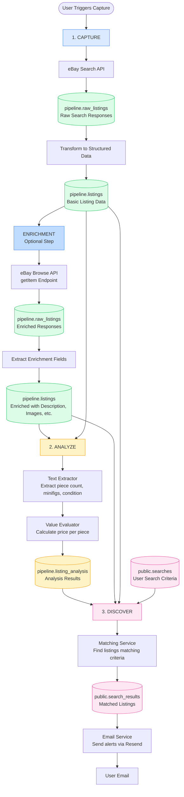
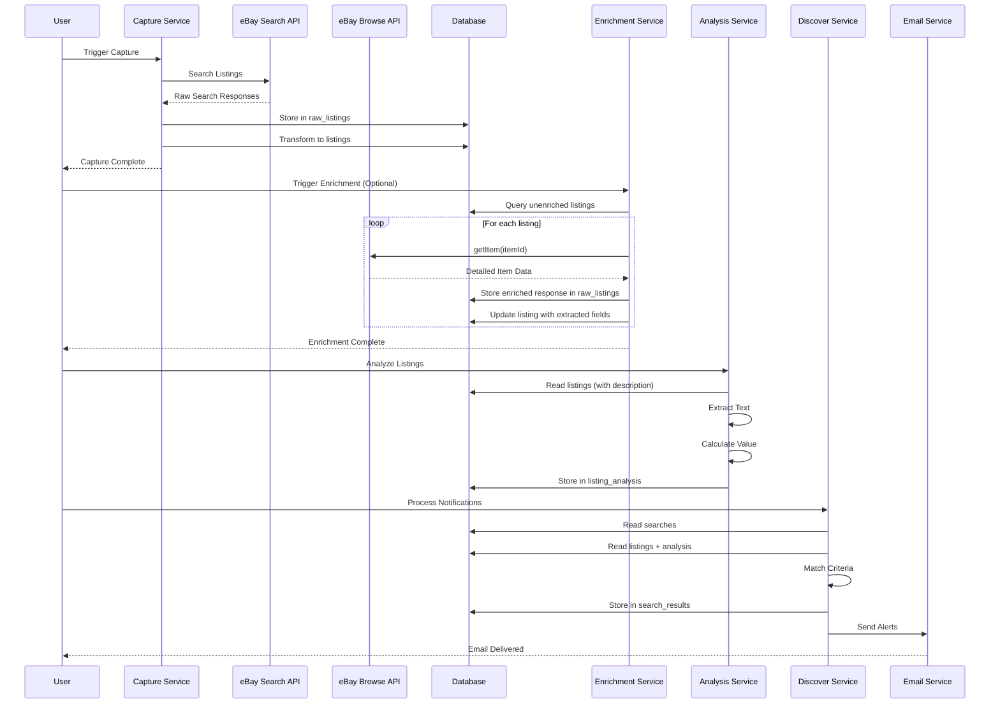

# Data Pipeline Documentation

This document describes how data flows through the LEGO marketplace scraper system.

## Pipeline Overview

The system processes data through three main stages: **Capture**, **Analyze**, and **Discover**.



## Stage 1: Capture

**Purpose**: Collect LEGO listings from marketplace APIs

### Initial Capture

**Process**:
1. Marketplace adapter (eBay) searches for listings using keywords via Search API
2. Raw API responses are stored in `pipeline.raw_listings` (ground truth)
3. Raw responses are transformed into structured `pipeline.listings` records
4. Deduplication ensures no duplicate listings are stored
5. Existing listings are updated with new `last_seen_at` timestamp

**Data Flow**:
```
eBay Search API → raw_listings → Transform → listings (basic data)
```

### Enrichment (Optional)

**Purpose**: Enhance listings with detailed information from eBay Browse API

**Process**:
1. Enrichment service queries for unenriched listings (`enriched_at IS NULL`)
2. For each listing, calls eBay Browse API `getItem` endpoint
3. Raw enriched responses stored in `pipeline.raw_listings`
4. Extracted fields updated in `pipeline.listings`:
   - `description` - Full listing description
   - `additional_images` - Array of additional image URLs
   - `condition_description` - Detailed condition information
   - `category_path` - Full category hierarchy
   - `item_location` - Structured location data
   - `estimated_availabilities` - Stock/quantity information
   - `buying_options` - Array of buying options
5. Listing marked as enriched with `enriched_at` timestamp

**Rate Limiting**: Configurable delay between API calls (default: 200ms) to prevent API abuse

**Data Flow**:
```
listings (unenriched) → eBay Browse API getItem → raw_listings (enriched) → Extract Fields → listings (enriched)
```

**Key Tables**:
- `pipeline.raw_listings`: Raw JSON responses from APIs (both search and enrichment)
- `pipeline.listings`: Structured listing data with enrichment fields
- `pipeline.capture_jobs`: Log of capture operations

**API Endpoints**:
- `POST /api/capture/trigger` - Trigger initial capture
- `POST /api/capture/enrich` - Trigger enrichment process

## Stage 2: Analyze

**Purpose**: Extract key attributes from listings and evaluate value

**Process**:
1. Text extractor parses listing title and description
2. Extracts: piece count, minifig count, condition
3. Value evaluator calculates price per piece
4. Results stored in `pipeline.listing_analysis`

**Extraction Methods**:
- **Piece Count**: Regex patterns for "500 pieces", "~1000 pcs", etc.
- **Minifig Count**: Regex patterns for "5 minifigs", "10 figs", etc.
- **Condition**: Keyword matching for "new", "used", "sealed", etc.
- **Price Per Piece**: Calculated from listing price ÷ piece count

**Key Tables**:
- `pipeline.listing_analysis`: Extracted attributes and calculated values

**Data Flow**:
```
listings → Text Extraction → Value Evaluation → listing_analysis
```

## Stage 3: Discover

**Purpose**: Match listings to user search criteria and send email alerts

**Process**:
1. Matching service compares `pipeline.listings` + `pipeline.listing_analysis` against `public.searches`
2. Matches are stored in `public.search_results`
3. Email service sends alerts for new matches via Resend
4. `notified_at` timestamp tracks which matches have been emailed

**Matching Criteria** (POC):
- `max_price_per_piece`: Only listings with price per piece ≤ search criteria

**Key Tables**:
- `public.searches`: User-defined search criteria
- `public.search_results`: Matched listings for each search

**Data Flow**:
```
listings + listing_analysis + searches → Matching → search_results → Email Alerts
```

## Schema Organization

### `pipeline` Schema
All data related to the capture and analysis pipeline:
- `raw_listings`: Raw API responses (ground truth) - includes both search and enrichment responses
- `listings`: Structured listing data with enrichment fields (description, additional_images, condition_description, category_path, item_location, estimated_availabilities, buying_options)
- `listing_analysis`: Extracted attributes and calculated values
- `capture_jobs`: Capture operation logs

### `public` Schema
All data related to user-facing features:
- `profiles`: User profiles (linked to auth.users)
- `searches`: User search criteria
- `search_results`: Matched listings (references `pipeline.listings`)

## Data Flow Sequence



## Key Design Decisions

1. **Raw Listings as Ground Truth**: All raw API responses are preserved in `raw_listings` for auditability and reprocessing
2. **Two-Step Capture Process**: Initial capture uses Search API for discovery, enrichment uses Browse API for detailed data
3. **Optional Enrichment**: Enrichment is a separate, optional step that can be run independently
4. **Schema Separation**: Pipeline data is isolated from user data for better organization and security
5. **Modular Value Evaluation**: Value evaluators are pluggable, allowing different evaluation strategies
6. **Deduplication**: Prevents duplicate listings while tracking when listings are seen again
7. **Analysis Versioning**: Analysis records include version numbers for algorithm changes
8. **Rate Limiting**: Enrichment includes configurable delays to prevent API abuse

